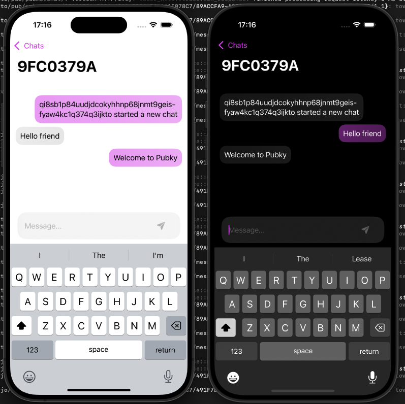

# Pubme

Pubme is a lightweight chat app built on the [Pubky](https://github.com/pubky). It gives users the freedom to choose and control their backend and storage, promoting privacy and censorship resistance. Whether you self-host, collaborate with others, or pick an external service, Pubme ensures you own your data and conversations.

This experiment in decentralized communication puts user autonomy at the forefront. Join us in redefining how we chat and explore the future of messaging with true user sovereignty.

# Development

### Setup home server

- Clone https://github.com/pubky/pubky
- cd pubky/pubky/pkg
- npm run testnet
- Should see `Homeserver listening on pubky://53o4xyymy815yp3kwttswsoub4od5wsddznjcz46tx65t31cbxro`
- Take that public key can put inside Env.swift

### Run iOS app

- Open Pubky.xcodeproj
- Product -> Run

## License

MIT
